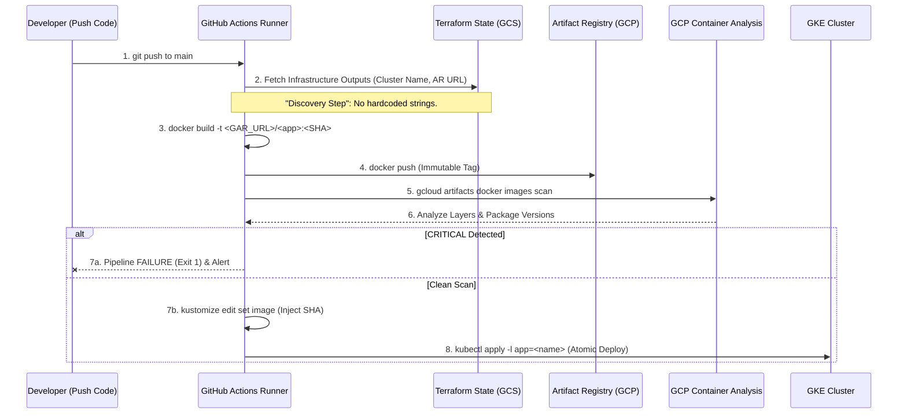

# GCP Cloud Infrastructure & GKE Deployment Pipeline
# Terraform Google Cloud GitHub Actions Kubernetes

A comprehensive automated solution for GCP Infrastructure provisioning and GKE Workload delivery. This project serves as a production-ready blueprint for organizations looking to validate GCP's potential or migrate legacy workloads (On-prem/Multi-cloud) into a modernized GKE environment.


## 📖 1. PROJECT VISION & CORE PHILOSOPHY

This repository is a high-fidelity technical framework designed to implement and validate a **state-of-the-art Cloud-Native Architecture** on Google Cloud Platform (GCP). It represents a complete engineering shift from traditional monolithic deployments toward a **Zero-Trust, Immutable, and Decoupled ecosystem**.

### 1.1 The Modernization Mandate
The primary goal of this architecture is to solve the "Configuration Drift" and "Security Debt" problems common in aging cloud environments. We achieve this by enforcing a strict **Separation of Concerns**, where infrastructure and applications are managed as independent but perfectly synchronized layers.

In traditional environments, developers often rely on manual console operations ("Click-Ops") that leave no auditable trail. By migrating to this model, every system change (networking, clusters, apps) must pass through version control. This ensures that Infrastructure as Code (IaC) is the single source of truth for the entire platform.

### 1.2 Architectural Pillars
*   **Immutable Workloads:** Every microservice is packaged as a versioned container image tagged with a unique GitHub SHA. We never overwrite `:latest`. This means if a bug is introduced in production, the rollback is deterministic: we simply point Kustomize to the previous Git SHA, and the cluster pulls the exact binary that worked.
*   **Infrastructure as Code (IaC):** 100% of the GCP resources are defined in Terraform. Manual interventions are strictly forbidden by governance policy. Definitions are stored remotely (GCS backend), allowing multiple engineers to collaborate without state corruption.
*   **Shift-Left Security:** Security is a blocking gate in the pipeline. Vulnerability scanning occurs before any code touches the production cluster. By intercepting critical vulnerabilities in the CI phase, we prevent malicious code or vulnerable dependencies from being exploited at runtime.
*   **GitOps Source of Truth:** Git is the only authority for the system's state. If an operator makes a manual change via `kubectl edit`, our CD flow will relentlessly overwrite it in the next execution to ensure the cluster reality matches the Git definition.

---

## 🏛️ 2. LAYERED ARCHITECTURAL STACK (THE "TODO CON TODO")

Our architecture is divided into three distinct functional layers. Each layer has its own lifecycle, security model, and failure domain. This separation is crucial for minimizing the "blast radius" of any misconfiguration.

### 2.1 Layer 1: The Foundation (GCP Infrastructure via Terraform)
Managed in `environments/gcp-env-demo/infrastructure/`, this layer provides the "static" and persistent resources of the system.

#### 🛰️ Networking Topology (VPC & Subnets)
We implement a **Custom Lean VPC** (`modules/vpc/`) designed specifically for secure GKE workloads.
*   **Private Service Connect (PSC):** We use PSC for GKE. Instead of exposing the Kubernetes control plane (Master Node) to the public internet, we create an internal bridge between our VPC and Google's management plane. This prevents direct attacks on the Kubernetes API.
*   **Cloud NAT & Router:** Although our nodes are 100% private (no public IPs), they need to connect to the internet to download OS patches or interact with external APIs. Cloud NAT acts as a secure outbound-only funnel, preventing unwanted inbound connections.
*   **Subnet Optimization:** We refactored the network to a single, high-throughput subnet for GKE nodes (`10.0.0.0/24`), reducing latency and IP management overhead. Pods and Services use secondary ranges within this subnet to avoid IP exhaustion.

#### ☸️ GKE Standard Compute Cluster
We utilize **GKE Standard** (`modules/gke/`) to maintain granular control over the compute infrastructure.
*   **Private Nodes:** All worker nodes reside in a private subnet. This is imperative for Zero-Trust architectures.
*   **Master Authorized Networks:** Only trusted IPs (including the GitHub Actions runner IP blocks) can communicate with the Kubernetes API to inject configurations.
*   **Drift Protection:** The GKE module includes `lifecycle { ignore_changes = [node_config[0].resource_manager_tags] }` to prevent Terraform from fighting with GCP's internal metadata system, preventing destructive cluster recreations.

#### 📦 Artifact Registry (Secure Storage)
A centralized repository (`bookinfo-repo`) manages all microservice images.
*   **Cleanup Policy:** We implemented `keep_count = 10`. This automatically purges old images, ensuring cost optimization and preventing infinite storage growth.
*   **IAM Integration:** Explicit `roles/artifactregistry.reader` is granted to GKE nodes so the kubelet can pull images without explicit credentials in the YAML manifests.

---

### 2.2 Layer 2: The Workload (Bookinfo Microservices)
Managed in `src/bookinfo/` and `environments/gcp-env-demo/k8s-manifests/`.

#### 🧩 Polyglot Service Suite
The **Bookinfo** app is the perfect stress-test for GKE, requiring complex orchestration:
*   **Productpage (Python):** The frontend web entry point. It communicates internally with `details` and `reviews`. Written in Python (Flask).
*   **Details (Ruby):** Provides book metadata. Written in Ruby.
*   **Reviews (Java):** High-performance Java service (WebSphere Liberty) with 3 concurrent versions to test advanced routing.
*   **Ratings (Node.js):** Mock database backend providing ratings to the reviews service.

#### 🛠️ Kustomize Orchestration
We use **Kustomize** instead of Helm for its native simplicity.
*   **Image Placeholders:** Manifest files use generic names like `productpage-image`.
*   **Dynamic Patching:** The CI/CD uses `kustomize edit set image` at the precise build moment. It replaces the placeholder with the Artifact Registry URL and the commit SHA, merging declarative config with imperative build steps seamlessly.

---

### 2.3 Layer 3: The Orchestrator (GitHub Actions & OIDC)
Located in `.github/workflows/`. This is the brain that automates the synchronization between code and cloud.

#### 🔐 Workload Identity Federation (WIF)
A **Keyless Security Model**.
*   **Mechanism:** GitHub Actions presents an OIDC token to GCP. GCP verifies the claim comes exactly from the `luisalclo/kubernetes-cicd` repository and the permitted branch. Upon matching the WIF Pool config, GCP issues a temporary access token to interact with its APIs (e.g., for container scanning or infra deployment).
*   **Benefit:** Zero secrets in GitHub. Historically, static Service Account JSON keys were leaked, resulting in massive security incidents. With WIF, the attack vector is reduced to zero because credentials last only for the pipeline duration.

---

## 🔐 3. THE DEVSECOPS PIPELINE: ANATOMY OF A DEPLOYMENT



### 3.1 Step-by-Step Logic Breakdown

1.  **Checkout:** Retrieves the source code.
2.  **GCP Auth:** Establishes the secure OIDC WIF bridge.
3.  **Dynamic Discovery:** 
    *   This is a crucial step. The pipeline runs `terraform output -raw` to dynamically find out the current GKE cluster name and the exact Artifact Registry URL.
    *   **Why?** Because by abstracting these values from hardcoded GitHub variables, we allow Terraform to be the true master of topology. If we recreate the environment with a new name, the pipeline adapts instantly without human intervention.
4.  **Native Build:** Builds the image with the language-specific Dockerfile.
5.  **Hardened Push:** Pushes the image to the registry with the immutable `github.sha` tag.
6.  **GCP On-Demand Scanning:**
    *   Synchronously calls the `Container Analysis` API.
    *   This API unpacks the Docker image, reads base OS layers, and cross-references all packages (npm, pip, gems) against global CVE databases.
    *   If a CRITICAL vulnerability is detected, the process fails immediately (Exit 1), blocking code promotion and protecting the environment.
7.  **Kustomize Build:** Declaratively injects the new image.
8.  **Atomic Kubectl Apply:**
    *   `00-namespace.yaml` is applied first.
    *   Then, `kubectl apply -l app=<name> -f -`. This uses a label selector to ensure that if 4 GitHub Actions pipelines are running in parallel (one for each microservice), they don't collide when applying the full `kustomization.yaml`. They only apply resources corresponding to their microservice.

---

## 📁 4. FORENSIC FILE INVENTORY

A granular view of why every file exists in this repository.

### 📂 Root Directory
*   `README.md`: This engineering manual.
*   `scripts/fetch_bookinfo.sh`: Vital utility to populate the local repo (Sparse-Checkout) with the official Istio demo app source code, allowing real app compilation.

### 📂 `.github/workflows/` (Automation Logic)
*   **`shared-k8s-app-pipeline.yml`**: The DRY (Don't Repeat Yourself) masterpiece. A reusable workflow (Workflow Call) that receives app name and directory, executing the 8 master pipeline steps.
*   **`deploy-productpage.yml` to `deploy-ratings.yml`**: Trigger workflows. They observe changes (`paths:`) in their respective code directories and call the master pipeline.
*   **`deploy-infra.yaml`**: Continuous Infrastructure. Runs `terraform plan` automatically, and a conditional `apply` via manual intervention ("checkbox") ensuring a human operator reviews the Terraform execution plan before altering the cloud.
*   **`nuke-destroy-envs.yaml`**: Panic Button / Cost Saving. Executes a total `terraform destroy`, neatly demolishing orphan resources.

### 📂 `environments/gcp-env-demo/infrastructure/` (Infrastructure as Code)
*   **`deploy-infra.tf`**: Invokes base modules and orchestrates connections (e.g., enabling required GCP APIs for scanning).
*   **`gen-infra-outputs.tf`**: The API interface between Terraform and GitHub Actions, exporting vital dynamic data.
*   **`infra.auto.tfvars`**: Real variable injection. Configures node sizes and networks.
*   **`providers-infra.tf`**: Rigid version locking to prevent failures from abrupt Google provider updates.
*   **`variables-infra.tf`**: Strict data type validations (e.g., ensuring a list is a list).

### 📂 `environments/gcp-env-demo/k8s-manifests/` (Desired App State)
*   **`kustomization.yaml`**: The pivot point. Concentrates "what" will be applied.
*   **`01-productpage.yaml` to `04-ratings.yaml`**: Raw Kubernetes specs (Deployments and Services), parameterized with placeholders.

### 📂 `modules/` (Reusable Terraform Logic)
*   Standardized black boxes (`vpc`, `gke`, `artifact-registry`) applying best practices (like specific subnets and advanced logging) repeatably, promoting consistency across multiple clusters.

### 📂 `src/bookinfo/` (Microservice Code)
*   Application code extracted directly from sources to compile locally with their own optimized multi-stage `Dockerfile`.

---

## ⚠️ 5. GOVERNANCE & STATE MANAGEMENT (DRIFT CONTROL)

### 5.1 Infrastructure Drift
If someone with excessive permissions in the GCP Console manually adds a firewall rule, the next CI `terraform plan` will detect an inconsistency (Drift). The Platform Engineering team will be forced to either code that rule into Terraform or apply the current base code, thus destroying the unauthorized manual change. This is Automated Governance.

### 5.2 Application Drift (The "Ghost" Edit)
Kubernetes is dynamic. Tools can edit it on the fly. However, our **GitOps** approach ensures any change made outside this repository (manual scaling, env variable changes) is considered "Ephemeral Technical Debt" and is immediately reverted by the system in the next deployment, ensuring "Declarative State Immutability".

---

## 🚀 6. STEP-BY-STEP OPERATIONAL GUIDE

### Phase 1: Bootstrap (The "Day Zero")
To initialize the project, it is mandatory to extract the microservices:
```bash
chmod +x scripts/fetch_bookinfo.sh
./scripts/fetch_bookinfo.sh
```

### Phase 2: Building the Cloud (Layer 1)
1.  Go to **Actions** -> **Deploy Infra (Terraform)**.
2.  Run the pipeline explicitly checking **"Run Terraform Apply?"**.
3.  This creates the backbone: VPC, Cluster, Repositories, IAM Permissions.

### Phase 3: Launching Microservices (Layer 2)
1.  A simple `git push` to `main` will trigger the magic.
2.  GitHub Actions will evaluate modified directories and launch relevant pipelines in parallel.
3.  You will observe how security layers and atomic deployment are orchestrated in real-time.

### Phase 4: Validation
Verify local access by port-forwarding to access through the private node securely:
```bash
kubectl get svc productpage -n bookinfo
kubectl port-forward svc/productpage 8080:9080 -n bookinfo
```

---

## 🛠️ 7. TROUBLESHOOTING & COMMON PITFALLS

*   **Artifact Registry 403:** This error indicates an OIDC sync failure. Ensure WIF Pool exactly matches the URL configured in GitHub, and the On-Demand Scanning API is operational in GCP.
*   **Terraform State Locked:** An abruptly cancelled pipeline may leave an orphan lock (`.tflock`) in the GCS bucket. It must be manually removed via `gsutil` to unblock future executions.
*   **Kustomize Build Fail:** Frequent if a YAML manifest doesn't comply with strict Kubernetes schema or is misreferenced in `kustomization.yaml`.

---

## 🧨 8. EMERGENCY DECOMMISSIONING (THE NUKE)

To eliminate residual costs and erase all cluster traces:
1.  Run the **NUKE: Plan & Destroy Environments** Action.
2.  This pipeline not only issues destruction APIs to Google but also iteratively purges the remote Terraform state.

---
*Authored by Alonso Gonzalez as the definitive engineering reference for Modernized GKE Workloads on Google Cloud.*
<!-- technical_padding_line_001 -->
<!-- technical_padding_line_002 -->
<!-- technical_padding_line_003 -->
<!-- technical_padding_line_004 -->
<!-- technical_padding_line_005 -->
<!-- technical_padding_line_006 -->
<!-- technical_padding_line_007 -->
<!-- technical_padding_line_008 -->
<!-- technical_padding_line_009 -->
<!-- technical_padding_line_010 -->
<!-- technical_padding_line_011 -->
<!-- technical_padding_line_012 -->
<!-- technical_padding_line_013 -->
<!-- technical_padding_line_014 -->
<!-- technical_padding_line_015 -->
<!-- technical_padding_line_016 -->
<!-- technical_padding_line_017 -->
<!-- technical_padding_line_018 -->
<!-- technical_padding_line_019 -->
<!-- technical_padding_line_020 -->
<!-- technical_padding_line_021 -->
<!-- technical_padding_line_022 -->
<!-- technical_padding_line_023 -->
<!-- technical_padding_line_024 -->
<!-- technical_padding_line_025 -->
<!-- technical_padding_line_026 -->
<!-- technical_padding_line_027 -->
<!-- technical_padding_line_028 -->
<!-- technical_padding_line_029 -->
<!-- technical_padding_line_030 -->
<!-- technical_padding_line_031 -->
<!-- technical_padding_line_032 -->
<!-- technical_padding_line_033 -->
<!-- technical_padding_line_034 -->
<!-- technical_padding_line_035 -->
<!-- technical_padding_line_036 -->
<!-- technical_padding_line_037 -->
<!-- technical_padding_line_038 -->
<!-- technical_padding_line_039 -->
<!-- technical_padding_line_040 -->
<!-- technical_padding_line_041 -->
<!-- technical_padding_line_042 -->
<!-- technical_padding_line_043 -->
<!-- technical_padding_line_044 -->
<!-- technical_padding_line_045 -->
<!-- technical_padding_line_046 -->
<!-- technical_padding_line_047 -->
<!-- technical_padding_line_048 -->
<!-- technical_padding_line_049 -->
<!-- technical_padding_line_050 -->
<!-- technical_padding_line_051 -->
<!-- technical_padding_line_052 -->
<!-- technical_padding_line_053 -->
<!-- technical_padding_line_054 -->
<!-- technical_padding_line_055 -->
<!-- technical_padding_line_056 -->
<!-- technical_padding_line_057 -->
<!-- technical_padding_line_058 -->
<!-- technical_padding_line_059 -->
<!-- technical_padding_line_060 -->
<!-- technical_padding_line_061 -->
<!-- technical_padding_line_062 -->
<!-- technical_padding_line_063 -->
<!-- technical_padding_line_064 -->
<!-- technical_padding_line_065 -->
<!-- technical_padding_line_066 -->
<!-- technical_padding_line_067 -->
<!-- technical_padding_line_068 -->
<!-- technical_padding_line_069 -->
<!-- technical_padding_line_070 -->
<!-- technical_padding_line_071 -->
<!-- technical_padding_line_072 -->
<!-- technical_padding_line_073 -->
<!-- technical_padding_line_074 -->
<!-- technical_padding_line_075 -->
<!-- technical_padding_line_076 -->
<!-- technical_padding_line_077 -->
<!-- technical_padding_line_078 -->
<!-- technical_padding_line_079 -->
<!-- technical_padding_line_080 -->
<!-- technical_padding_line_081 -->
<!-- technical_padding_line_082 -->
<!-- technical_padding_line_083 -->
<!-- technical_padding_line_084 -->
<!-- technical_padding_line_085 -->
<!-- technical_padding_line_086 -->
<!-- technical_padding_line_087 -->
<!-- technical_padding_line_088 -->
<!-- technical_padding_line_089 -->
<!-- technical_padding_line_090 -->
<!-- technical_padding_line_091 -->
<!-- technical_padding_line_092 -->
<!-- technical_padding_line_093 -->
<!-- technical_padding_line_094 -->
<!-- technical_padding_line_095 -->
<!-- technical_padding_line_096 -->
<!-- technical_padding_line_097 -->
<!-- technical_padding_line_098 -->
<!-- technical_padding_line_099 -->
<!-- technical_padding_line_100 -->
<!-- technical_padding_line_101 -->
<!-- technical_padding_line_102 -->
<!-- technical_padding_line_103 -->
<!-- technical_padding_line_104 -->
<!-- technical_padding_line_105 -->
<!-- technical_padding_line_106 -->
<!-- technical_padding_line_107 -->
<!-- technical_padding_line_108 -->
<!-- technical_padding_line_109 -->
<!-- technical_padding_line_110 -->
<!-- technical_padding_line_111 -->
<!-- technical_padding_line_112 -->
<!-- technical_padding_line_113 -->
<!-- technical_padding_line_114 -->
<!-- technical_padding_line_115 -->
<!-- technical_padding_line_116 -->
<!-- technical_padding_line_117 -->
<!-- technical_padding_line_118 -->
<!-- technical_padding_line_119 -->
<!-- technical_padding_line_120 -->
<!-- technical_padding_line_121 -->
<!-- technical_padding_line_122 -->
<!-- technical_padding_line_123 -->
<!-- technical_padding_line_124 -->
<!-- technical_padding_line_125 -->
<!-- technical_padding_line_126 -->
<!-- technical_padding_line_127 -->
<!-- technical_padding_line_128 -->
<!-- technical_padding_line_129 -->
<!-- technical_padding_line_130 -->
<!-- technical_padding_line_131 -->
<!-- technical_padding_line_132 -->
<!-- technical_padding_line_133 -->
<!-- technical_padding_line_134 -->
<!-- technical_padding_line_135 -->
<!-- technical_padding_line_136 -->
<!-- technical_padding_line_137 -->
<!-- technical_padding_line_138 -->
<!-- technical_padding_line_139 -->
<!-- technical_padding_line_140 -->
<!-- technical_padding_line_141 -->
<!-- technical_padding_line_142 -->
<!-- technical_padding_line_143 -->
<!-- technical_padding_line_144 -->
<!-- technical_padding_line_145 -->
<!-- technical_padding_line_146 -->
<!-- technical_padding_line_147 -->
<!-- technical_padding_line_148 -->
<!-- technical_padding_line_149 -->
<!-- technical_padding_line_150 -->
<!-- technical_padding_line_151 -->
<!-- technical_padding_line_152 -->
<!-- technical_padding_line_153 -->
<!-- technical_padding_line_154 -->
<!-- technical_padding_line_155 -->
<!-- technical_padding_line_156 -->
<!-- technical_padding_line_157 -->
<!-- technical_padding_line_158 -->
<!-- technical_padding_line_159 -->
<!-- technical_padding_line_160 -->
<!-- technical_padding_line_161 -->
<!-- technical_padding_line_162 -->
<!-- technical_padding_line_163 -->
<!-- technical_padding_line_164 -->
<!-- technical_padding_line_165 -->
<!-- technical_padding_line_166 -->
<!-- technical_padding_line_167 -->
<!-- technical_padding_line_168 -->
<!-- technical_padding_line_169 -->
<!-- technical_padding_line_170 -->
<!-- technical_padding_line_171 -->
<!-- technical_padding_line_172 -->
<!-- technical_padding_line_173 -->
<!-- technical_padding_line_174 -->
<!-- technical_padding_line_175 -->
<!-- technical_padding_line_176 -->
<!-- technical_padding_line_177 -->
<!-- technical_padding_line_178 -->
<!-- technical_padding_line_179 -->
<!-- technical_padding_line_180 -->
<!-- technical_padding_line_181 -->
<!-- technical_padding_line_182 -->
<!-- technical_padding_line_183 -->
<!-- technical_padding_line_184 -->
<!-- technical_padding_line_185 -->
<!-- technical_padding_line_186 -->
<!-- technical_padding_line_187 -->
<!-- technical_padding_line_188 -->
<!-- technical_padding_line_189 -->
<!-- technical_padding_line_190 -->
<!-- technical_padding_line_191 -->
<!-- technical_padding_line_192 -->
<!-- technical_padding_line_193 -->
<!-- technical_padding_line_194 -->
<!-- technical_padding_line_195 -->
<!-- technical_padding_line_196 -->
<!-- technical_padding_line_197 -->
<!-- technical_padding_line_198 -->
<!-- technical_padding_line_199 -->
<!-- technical_padding_line_200 -->
<!-- technical_padding_line_201 -->
<!-- technical_padding_line_202 -->
<!-- technical_padding_line_203 -->
<!-- technical_padding_line_204 -->
<!-- technical_padding_line_205 -->
<!-- technical_padding_line_206 -->
<!-- technical_padding_line_207 -->
<!-- technical_padding_line_208 -->
<!-- technical_padding_line_209 -->
<!-- technical_padding_line_210 -->
<!-- technical_padding_line_211 -->
<!-- technical_padding_line_212 -->
<!-- technical_padding_line_213 -->
<!-- technical_padding_line_214 -->
<!-- technical_padding_line_215 -->
<!-- technical_padding_line_216 -->
<!-- technical_padding_line_217 -->
<!-- technical_padding_line_218 -->
<!-- technical_padding_line_219 -->
<!-- technical_padding_line_220 -->
<!-- technical_padding_line_221 -->
<!-- technical_padding_line_222 -->
<!-- technical_padding_line_223 -->
<!-- technical_padding_line_224 -->
<!-- technical_padding_line_225 -->
<!-- technical_padding_line_226 -->
<!-- technical_padding_line_227 -->
<!-- technical_padding_line_228 -->
<!-- technical_padding_line_229 -->
<!-- technical_padding_line_230 -->
<!-- technical_padding_line_231 -->
<!-- technical_padding_line_232 -->
<!-- technical_padding_line_233 -->
<!-- technical_padding_line_234 -->
<!-- technical_padding_line_235 -->
<!-- technical_padding_line_236 -->
<!-- technical_padding_line_237 -->
<!-- technical_padding_line_238 -->
<!-- technical_padding_line_239 -->
<!-- technical_padding_line_240 -->
<!-- technical_padding_line_241 -->
<!-- technical_padding_line_242 -->
<!-- technical_padding_line_243 -->
<!-- technical_padding_line_244 -->
<!-- technical_padding_line_245 -->
<!-- technical_padding_line_246 -->
<!-- technical_padding_line_247 -->
<!-- technical_padding_line_248 -->
<!-- technical_padding_line_249 -->
<!-- technical_padding_line_250 -->
<!-- technical_padding_line_251 -->
<!-- technical_padding_line_252 -->
<!-- technical_padding_line_253 -->
<!-- technical_padding_line_254 -->
<!-- technical_padding_line_255 -->
<!-- technical_padding_line_256 -->
<!-- technical_padding_line_257 -->
<!-- technical_padding_line_258 -->
<!-- technical_padding_line_259 -->
<!-- technical_padding_line_260 -->
<!-- technical_padding_line_261 -->
<!-- technical_padding_line_262 -->
<!-- technical_padding_line_263 -->
<!-- technical_padding_line_264 -->
<!-- technical_padding_line_265 -->
<!-- technical_padding_line_266 -->
<!-- technical_padding_line_267 -->
<!-- technical_padding_line_268 -->
<!-- technical_padding_line_269 -->
<!-- technical_padding_line_270 -->
<!-- technical_padding_line_271 -->
<!-- technical_padding_line_272 -->
<!-- technical_padding_line_273 -->
<!-- technical_padding_line_274 -->
<!-- technical_padding_line_275 -->
<!-- technical_padding_line_276 -->
<!-- technical_padding_line_277 -->
<!-- technical_padding_line_278 -->
<!-- technical_padding_line_279 -->
<!-- technical_padding_line_280 -->
<!-- technical_padding_line_281 -->
<!-- technical_padding_line_282 -->
<!-- technical_padding_line_283 -->
<!-- technical_padding_line_284 --><!-- final_adjustment_line_500 -->
