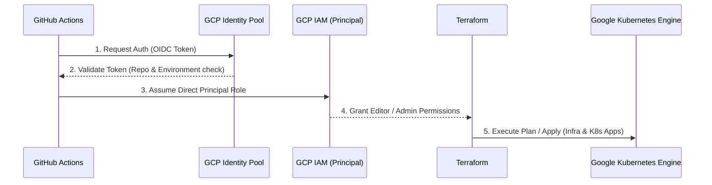

# 🚀 GCP Cloud Infrastructure & GKE Deployment Pipeline


A comprehensive automated solution for **GCP Infrastructure provisioning** and **GKE Workload delivery**. This project leverages **Terraform** for full-stack cloud resources and **GitHub Actions** for high-velocity GitOps orchestration, ensuring a production-grade environment.

---

## 🏗️ Architecture Overview

The system is designed to manage the full lifecycle of a GKE-based environment within the GCP project `developer-sandbox-489120`.

*   **GCP Networking:** Custom VPC with isolated subnets for GKE Nodes, Services, and Management (Jumpbox).
*   **GKE Compute:** A Google Kubernetes Engine (GKE) **Standard** Cluster with private nodes and master authorized networks.
*   **Security & Identity:** **Keyless Authentication** using Workload Identity Federation (WIF) and direct principal bindings.
*   **GKE Workloads:** Automated deployment of microservices (Bookinfo) via the Terraform `kubernetes` provider.

### 🔐 Authentication Flow (Workload Identity Federation)

To achieve zero-trust and eliminate the need for long-lived Service Account JSON keys, this project uses OIDC-based authentication.



---

## 📁 Repository Structure

The codebase is organized into modular components to separate infrastructure lifecycle from application delivery.

```text
.
├── .github/workflows/
│   ├── deploy-infra.yaml        # Provisions VPC, Subnets, and GKE Cluster
│   ├── deploy-apps.yml          # Deploys K8s workloads via Terraform provider
│   └── build-deploy.yml         # Shared or legacy CI/CD logic
├── environments/gcp-env-demo/
│   ├── infrastructure/          # Layer 1: Base Cloud Infrastructure
│   │   ├── backend-infra.tf     # Remote GCS backend configuration
│   │   ├── deploy-infra.tf      # Main orchestration logic (VPC + GKE)
│   │   ├── gen-infra-outputs.tf # Infrastructure resource outputs
│   │   ├── providers-infra.tf   # Google Cloud provider definition
│   │   ├── variables-infra.tf   # Variable declarations for infra
│   │   └── infra.auto.tfvars    # Environment-specific values
│   └── k8s-apps/                # Layer 2: Kubernetes Workloads
│       ├── backend-k8s.tf       # Remote GCS backend for apps state
│       ├── deploy-k8s.tf        # K8s Deployment & Service manifests
│       ├── gen-k8s-outputs.tf   # App layer outputs
│       ├── providers-k8s.tf     # K8s and Helm provider definitions
│       ├── variables-k8s.tf     # Variable declarations for apps
│       └── k8s.auto.tfvars      # App-specific parameters
└── modules/                     # Reusable Terraform Modules
    ├── vpc/                     # Network & Firewall logic
    │   ├── main.tf              # VPC and Subnet resources
    │   ├── variables.tf         # Module inputs
    │   └── outputs.tf           # Module outputs
    ├── gke/                     # GKE Cluster & Node Pool logic
    │   ├── main.tf              # Cluster and Node Pool definition
    │   ├── variables.tf         # GKE specific variables
    │   └── outputs.tf           # GKE resource outputs
    └── compute-engine/          # Bastion/Jumpbox configuration
        ├── main.tf              # VM instance resources
        ├── variables.tf         # VM specific inputs
        └── outputs.tf           # VM outputs
```

---

## 🛤️ Branching Strategy & Path Filtering

This repository follows **Trunk-Based Development**, utilizing a single `main` branch as the **Single Source of Truth**.

### 1. Single Branch (Main-Only)
We intentionally avoid long-lived feature branches or multiple environment branches (like `dev`, `staging`, `prod`). This approach:
*   **Eliminates Merge Hell:** Ensures that all team members are working on the latest state.
*   **Simplifies State:** What you see in `main` is exactly what is deployed (or being deployed) in the environment.

### 2. Intelligent Path Triggers
Since this is a "Monorepo-lite" containing both infrastructure and application manifests, we use GitHub Actions **Path Filtering** to decouple their lifecycles:

*   **Infrastructure Changes:** Only modifications within `environments/gcp-env-demo/infrastructure/**` or `modules/**` trigger the `deploy-infra.yaml` pipeline.
*   **Application Changes:** Only modifications within `environments/gcp-env-demo/k8s-apps/**` trigger the `deploy-apps.yml` pipeline.

This ensures that updating a Kubernetes manifest doesn't trigger a full Terraform plan for the VPC/GKE cluster, saving time and reducing the risk of accidental infrastructure changes.

---

## 📖 Why This Approach? (The GitOps Philosophy)

We chose this architecture to adhere to the core pillars of **GitOps**:

### 1. Declarative Everything
The entire system—from the VPC and GKE cluster to the specific Kubernetes Deployments—is defined **declaratively** using Terraform. We don't use "click-ops" in the GCP console or `kubectl` commands.

### 2. Versioned & Immutable
Git acts as the immutable log for the environment. Every change to the infrastructure or the apps is captured in a commit. If something breaks, we don't "patch" the environment; we revert the commit or push a fix to Git.

### 3. Automated Reconcilliation
By using GitHub Actions, the system automatically attempts to reconcile the "Observed State" (what is running in GCP) with the "Desired State" (what is written in Git). 

### 4. Decoupled Lifecycles
We split **Infrastructure** from **Applications** because they move at different speeds:
*   **Infra Layer:** Stable, rarely changed, and high-impact.
*   **App Layer:** Fast-moving, frequently updated, and low-impact (isolated to the cluster).
By separating them into different Terraform state files and workflows, we ensure a failure in an app deployment cannot corrupt the infrastructure state.

---

## 🚀 CI/CD Pipelines

### 1. Infrastructure Pipeline (`deploy-infra.yaml`)
Triggered by changes in `environments/gcp-env-demo/infrastructure/**` or manually.
*   **Environment:** `production` (Required for IAM matching).
*   **Auth:** Direct Principal Auth (no impersonation).
*   **Logic:** Executes `terraform init`, `plan`, and `apply` (manual confirmation required for apply).

### 2. Application Pipeline (`deploy-apps.yml`)
Triggered by changes in `environments/gcp-env-demo/k8s-apps/**`.
*   **Logic:** Uses the output of the Infrastructure layer (via remote state) to connect to the GKE cluster and deploy resources.

---

## 🛠️ GCP Setup (One-Time)

To enable the keyless authentication used in this repo, the following resources must be configured in GCP:

### 1. Create Workload Identity Pool & Provider
```bash
# Create Identity Pool
gcloud iam workload-identity-pools create "github-identity-pool" \
  --project="developer-sandbox-489120" \
  --location="global" \
  --display-name="GitHub Actions Pool"

# Create OIDC Provider for GitHub
gcloud iam workload-identity-pools providers create-oidc "github" \
  --project="developer-sandbox-489120" \
  --location="global" \
  --workload-identity-pool="github-identity-pool" \
  --attribute-mapping="google.subject=assertion.sub,attribute.actor=assertion.actor,attribute.repository=assertion.repository" \
  --issuer-uri="https://token.actions.githubusercontent.com"
```

### 2. Grant Permissions to the GitHub Repository
The IAM binding is strictly scoped to the repository and the GitHub Environment (`production`):

```bash
gcloud projects add-iam-policy-binding "developer-sandbox-489120" \
  --role="roles/editor" \
  --member="principal://iam.googleapis.com/projects/697350290405/locations/global/workloadIdentityPools/github-identity-pool/subject/repo:YOUR_GH_USER/kubernetes-cicd:environment:production"
```

---

## 📝 Best Practices Followed

*   **Modular Design:** Infrastructure is split into reusable modules, allowing for easy expansion.
*   **State Management:** Remote state is stored in GCS buckets (`gcp-demo-gkefeb2026`) with locking support.
*   **Security:** No hardcoded secrets. Workload Identity Federation ensures that credentials are short-lived and non-exportable.
*   **Least Privilege:** IAM roles are bound directly to the repository identity, minimizing the attack surface.

---

## 🔧 Troubleshooting

| Issue | Root Cause | Solution |
| :--- | :--- | :--- |
| **403 Forbidden** | IAM Principal mismatch | Ensure the `environment: 'production'` is set in the GitHub Workflow. |
| **Backend 404** | GCS Bucket missing | Verify that the bucket `gcp-demo-gkefeb2026` exists in the project. |
| **GKE 401 Unauth** | Cluster connectivity | Check if `master_authorized_networks` allows the GitHub Runner IP (currently set to 0.0.0.0/0). |

---

## 🎯 Demo Walkthrough (Step-by-Step)

This guide provides a structured flow to demonstrate the full lifecycle of the project, from infrastructure provisioning to application delivery.

### Phase 1: Infrastructure Provisioning (Safe Rollout)
1.  **Code Change:** Modify a variable in `environments/gcp-env-demo/infrastructure/infra.auto.tfvars` (e.g., change `std_node_count`).
2.  **CI Trigger:** Push to `main`. The `deploy-infra.yaml` workflow triggers automatically.
3.  **The "Safety Net":** Observe that the workflow executes `terraform plan` but **stops** before `apply`. This demonstrates a real-world production control.
4.  **Manual Approval:** Go to the **Actions** tab in GitHub, select the latest run, and trigger the `workflow_dispatch` with the `run_apply` checkbox enabled to finalize the infra.

### Phase 2: Application Deployment (GitOps Flow)
1.  **Code Change:** Update a manifest in `environments/gcp-env-demo/k8s-apps/deploy-k8s.tf` (e.g., change the image version of `reviews-v3`).
2.  **Intelligent Trigger:** Push to `main`. Notice that **only** the `deploy-apps.yml` pipeline triggers. The VPC/GKE infra remains untouched (Path Filtering).
3.  **State Integration:** The App pipeline automatically "pulls" the GKE endpoint and credentials from the Infra state file via `terraform_remote_state`.
4.  **Verification:** Once finished, access the `productpage` external IP (Type: LoadBalancer) to see the Bookinfo microservices communicating via Internal Services.

### Phase 3: Zero-Trust Verification
*   **Audit Log:** Check the GCP IAM console. You will see no Service Account keys. All actions are performed via the **Short-lived OIDC Token** granted to the GitHub Actions principal.

---
*Developed as a GitOps reference for GCP & Kubernetes.*
