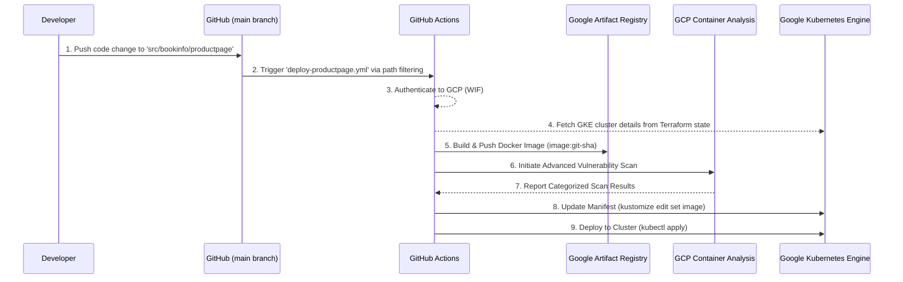

# 🚀 GCP Infrastructure (IaC) & GKE Application (CI/CD) Pipeline


A comprehensive automated solution for **GCP Infrastructure provisioning (via Terraform)** and **GKE Application Delivery (via a modern CI/CD pipeline)**. This project serves as a **production-ready blueprint** for a hybrid approach where infrastructure is managed declaratively (IaC), and applications are built from source and deployed continuously.

---

## 🏗️ Architecture Overview: A Hybrid Approach

This project demonstrates a sophisticated, real-world cloud-native architecture that separates concerns between two distinct, loosely-coupled lifecycles: **Infrastructure** and **Application**.

### Layer 1: The Infrastructure Platform (IaC with Terraform)
This layer is the stable, long-lived foundation of the entire environment. It is managed exclusively with Infrastructure as Code (IaC) using Terraform, ensuring it is versioned, repeatable, and auditable. This layer rarely changes. The primary logic is in `deploy-infra.tf`, which uses the following reusable modules:

*   **Components:**
    *   **GCP Networking (`vpc` module):** Establishes a custom Virtual Private Cloud (VPC) with granular subnets for different traffic types (GKE Nodes, Pods, and Services). This provides network-level isolation, a core tenant of secure multi-tenant clusters.
    *   **GKE Compute (`gke` module):** Provisions a **private** Google Kubernetes Engine (GKE) Standard Cluster. "Private" is a critical security distinction, meaning nodes do not have public IP addresses and are shielded from the public internet. Access to the Kubernetes API master is locked down via `master_authorized_networks`, ensuring only authorized entities can communicate with it.
    *   **Artifact Registry (`artifact-registry` module):** Deploys a dedicated Artifact Registry repository. This secure, private registry is used to store and manage the Docker container images built by the CI/CD pipeline before they are deployed to GKE.
    *   **Bastion Host (`compute-engine` module):** The repository includes a module for provisioning a bastion host (or "jumpbox") VM. While this is a common pattern for accessing private GKE clusters, in this architecture **it is not used**. We are favoring direct connection via the browser-based **GCP Cloud Shell**, which has built-in utilities and doesn't require managing a separate VM. The module remains for reference or future use cases.
    *   **Security & Identity (Workload Identity Federation):** This is the cornerstone of our keyless security posture. Instead of using static, long-lived Service Account keys (a major security risk), we configure GCP to trust GitHub Actions as a federated identity provider. This allows the CI/CD pipeline to dynamically obtain short-lived, ephemeral GCP access tokens, drastically reducing the risk of credential leakage.

### Layer 2: The Application Lifecycle (CI/CD)
This layer is dynamic and fast-moving, representing the actual business logic. Applications are NOT deployed with Terraform. Instead, a robust CI/CD pipeline automates the entire process of transforming source code into a running, secured workload in the GKE cluster.

*   **Components:**
    *   **Source Code (`src/bookinfo`):** The single source of truth for all application code. This directory contains a polyglot microservices application (Python, Java, Node.js, Ruby), demonstrating the platform's versatility. A change to any microservice's specific subdirectory is the catalyst for a new, targeted deployment of *only that service*.
    *   **CI/CD Pipeline (`shared-k8s-app-pipeline.yml`):** This is the automated DevSecOps engine for the application layer. It is designed as a reusable workflow (invoked via `workflow_call`), allowing it to be parameterized and called by simpler "caller" workflows. It enforces a strict "Build -> Push -> Scan -> Deploy" lifecycle for every microservice, ensuring consistency and quality control.
    *   **Kubernetes Manifests (`k8s-manifests/` & Kustomize):** This directory contains the declarative, plain Kubernetes YAML files that define the desired state of the applications (Deployments, Services, etc.). We use **Kustomize** for template-free YAML management. Its key function here is the dynamic, in-pipeline image update: the CI/CD process uses the `kustomize edit set image` command to replace a generic placeholder in the manifest (e.g., `productpage-image`) with the immutable, SHA-tagged image created during the build step (e.g., `us-central1-docker.pkg.dev/project/repo/productpage:git-sha-xyz`). This guarantees that the exact artifact that was built and scanned is what gets deployed.

---

## 📖 Why This Hybrid Approach? The Best of Both Worlds

We chose this architecture to leverage the strengths of two different philosophies:

### 1. GitOps for Infrastructure
The entire infrastructure platform (VPC, GKE cluster, IAM) is defined **declaratively** using Terraform. Git is the single source of truth. This is a classic, pure **GitOps** model, perfect for the stable foundation of our environment.

### 2. CI/CD for Applications
For the fast-moving application layer, a pure GitOps model (where every change is a manifest change) can be cumbersome. A **CI/CD** approach provides more power and flexibility:
*   **Build from Source:** We ensure that what's deployed is exactly what was built from the `main` branch, creating a verifiable chain of custody.
*   **Immutable Artifacts:** The pipeline produces versioned, immutable Docker images (`image:git-sha`). We don't change running containers; we deploy new ones.
*   **Integrated Quality Gates:** The pipeline automatically performs security scans on every new image, providing a critical quality gate before deployment.
*   **Developer Experience:** Developers can focus on writing code in `src/`. The pipeline handles the rest, abstracting away the complexities of containerization and deployment.

---

## 🚀 The Application CI/CD Flow

The heart of the application layer is the automated pipeline. Here is the detailed flow when a developer pushes a code change, including the integrated security scanning engine.



---

## 📁 Repository Structure

The codebase is organized into modular components to separate the two main lifecycles.

```text
.
├── .github/workflows/
│   ├── deploy-details.yml
│   ├── deploy-infra.yaml
│   ├── deploy-productpage.yml
│   ├── deploy-ratings.yml
│   ├── deploy-reviews.yml
│   ├── nuke-destroy-envs.yaml
│   └── shared-k8s-app-pipeline.yml
├── environments/gcp-env-demo/
│   ├── infrastructure/
│   │   ├── backend-infra.tf
│   │   ├── deploy-infra.tf
│   │   ├── gen-infra-outputs.tf
│   │   ├── infra.auto.tfvars
│   │   ├── providers-infra.tf
│   │   └── variables-infra.tf
│   └── k8s-manifests/
│       ├── 00-namespace.yaml
│       ├── 01-productpage.yaml
│       ├── 02-details.yaml
│       ├── 03-reviews.yaml
│       ├── 04-ratings.yaml
│       └── kustomization.yaml
├── modules/
│   ├── compute-engine/
│   │   ├── main.tf
│   │   ├── outputs.tf
│   │   └── variables.tf
│   ├── gke/
│   │   ├── main.tf
│   │   ├── outputs.tf
│   │   └── variables.tf
│   └── vpc/
│       ├── main.tf
│       ├── outputs.tf
│       └── variables.tf
└── src/bookinfo/
    ├── details/
    │   ├── details.rb
    │   └── Gemfile.lock
    ├── productpage/
    │   ├── productpage.py
    │   ├── requirements.in
    │   ├── requirements.txt
    │   ├── static/img/izzy.png
    │   ├── static/tailwind/tailwind.css
    │   ├── templates/index.html
    │   ├── templates/productpage.html
    │   ├── test-requirements.in
    │   ├── test-requirements.txt
    │   └── tests/unit/test_productpage.py
    ├── ratings/
    │   ├── package.json
    │   └── ratings.js
    └── reviews/
        ├── .gitignore
        ├── build.gradle
        ├── reviews-application/
        │   ├── build.gradle
        │   └── src/
        │       ├── main/
        │       │   ├── java/application/
        │       │   │   ├── ReviewsApplication.java
        │       │   │   └── rest/LibertyRestEndpoint.java
        │       │   └── webapp/
        │       │       ├── index.html
        │       │       └── WEB-INF/
        │       │           ├── ibm-web-ext.xml
        │       │           └── web.xml
        │       └── test/
        │           └── java/test/TestApplication.java
        ├── reviews-wlpcfg/
        │   ├── build.gradle
        │   ├── servers/LibertyProjectServer/server.xml
        │   ├── shared/.gitkeep
        │   └── src/
        │       └── test/
        │           └── java/it/
        │               ├── EndpointTest.java
        │               ├── LibertyRestEndpointTest.java
        │               └── TestApplication.java
        └── settings.gradle
```

---

## 🛤️ Branching Strategy & Path Filtering

This repository follows **Trunk-Based Development** on the `main` branch. We use GitHub Actions **Path Filtering** to intelligently trigger the correct pipeline and decouple the lifecycles:

*   **Infrastructure Changes:** Only modifications within `environments/gcp-env-demo/infrastructure/**` or `modules/**` trigger the `deploy-infra.yaml` (IaC) pipeline.
*   **Application Changes:** Modifications within `src/bookinfo/<app-name>/**` or `environments/gcp-env-demo/k8s-manifests/<app-name>.yaml` trigger the corresponding application deployment (CI/CD) pipeline (e.g., `deploy-productpage.yml`).

This ensures that updating application source code doesn't trigger a Terraform plan, and changing infrastructure doesn't trigger an unnecessary application build.

---

## 🚀 CI/CD Pipelines Explained

### 1. Infrastructure Pipeline (`deploy-infra.yaml`)
*   **Purpose:** To manage the lifecycle of the foundational GCP infrastructure using Terraform.
*   **Trigger:** Changes to files in `infrastructure/` or `modules/`.
*   **Logic:** Executes `terraform init`, `plan`, and `apply` (manual confirmation required for apply).

### 2. Application Pipelines (Two-Tiered)

#### Tier 1: Caller Workflows (`deploy-productpage.yml`, `deploy-details.yml`, `deploy-reviews.yml`, `deploy-ratings.yml`)
*   **Purpose:** To act as a simple trigger. It watches specific file paths and, when a change is detected, calls the shared pipeline with the correct parameters for that microservice.
*   **Trigger:** Changes to an application's source code (`src/bookinfo/productpage/**`, `src/bookinfo/details/**`, etc.) or its specific Kubernetes manifest.
*   **Logic:** Contains a `uses: ./.github/workflows/shared-k8s-app-pipeline.yml` block, passing `app_name` and `app_dir` as inputs.

#### Tier 2: Shared Workflow (`shared-k8s-app-pipeline.yml`)
*   **Purpose:** To execute the entire build, scan, and deploy process for any given application. This reusable workflow contains all the complex logic.
*   **Stages:**
    1.  **Authentication:** Authenticates to GCP using Workload Identity Federation.
    2.  **Fetch Infrastructure State:** Runs `terraform output` on the infrastructure state to dynamically get the GKE cluster name and Artifact Registry URL. This brilliantly decouples the layers.
    3.  **Build:** Builds a Docker image from the application's source directory, tagging it with the Git commit SHA (`github.sha`).
    4.  **Push:** Pushes the new image to Google Artifact Registry.
    5.  **Scan (Advanced Security Engine):** This stage uses a custom `gcloud` script that serves as an integrated security engine. It doesn't just scan; it extracts, categorizes, and mathematically counts every vulnerability based on its CVSS severity. The engine specifically audits five categories: `CRITICAL`, `HIGH`, `MEDIUM`, `LOW`, and the vital `UNSPECIFIED` category (for vulnerabilities without an official CVSS score yet). This meticulous counting of `UNSPECIFIED` ensures the pipeline's totals precisely match the Google Artifact Registry console. If the engine detects one or more `CRITICAL` vulnerabilities, it automatically formats and prints a clean, native GCP table directly into the GitHub Actions logs, providing immediate visibility of the CVE, affected package, and CVSS score to the developer.
    6.  **Deploy:** Gets GKE credentials, then uses `kustomize edit set image` to update the `kustomization.yaml` file in memory with the new image tag. Finally, it runs `kustomize build . | kubectl apply -f -` to deploy the changes to the cluster.

---

## 🛠️ GCP Setup (One-Time)

This setup is required for the keyless authentication to work.

### 1. Create Workload Identity Pool & Provider
```bash
# Create Identity Pool
gcloud iam workload-identity-pools create "github-identity-pool" 
  --project="developer-sandbox-489120" 
  --location="global" 
  --display-name="GitHub Actions Pool"

# Create OIDC Provider for GitHub
gcloud iam workload-identity-pools providers create-oidc "github" 
  --project="developer-sandbox-489120" 
  --location="global" 
  --workload-identity-pool="github-identity-pool" 
  --attribute-mapping="google.subject=assertion.sub,attribute.actor=assertion.actor,attribute.repository=assertion.repository" 
  --issuer-uri="https://token.actions.githubusercontent.com"
```

### 2. Grant Permissions to the GitHub Repository

For a modern DevSecOps architecture, the primitive `roles/editor` is insufficient and overly permissive. The pipeline's Service Identity requires specific, granular permissions to interact with various GCP APIs securely.

```bash
# Required by Terraform to manage IAM policies for other services
gcloud projects add-iam-policy-binding "developer-sandbox-489120" 
  --role="roles/resourcemanager.projectIamAdmin" 
  --member="principal://iam.googleapis.com/projects/697350290405/locations/global/workloadIdentityPools/github-identity-pool/subject/repo:YOUR_GH_USER/kubernetes-cicd:environment:production"

# Required for the CI/CD pipeline to invoke the Container Analysis API and perform scans
gcloud projects add-iam-policy-binding "developer-sandbox-489120" 
  --role="roles/containeranalysis.admin" 
  --member="principal://iam.googleapis.com/projects/697350290405/locations/global/workloadIdentityPools/github-identity-pool/subject/repo:YOUR_GH_USER/kubernetes-cicd:environment:production"

# Required for the CI/CD pipeline to trigger on-demand scans of container images
gcloud projects add-iam-policy-binding "developer-sandbox-489120" 
  --role="roles/ondemandscanning.admin" 
  --member="principal://iam.googleapis.com/projects/697350290405/locations/global/workloadIdentityPools/github-identity-pool/subject/repo:YOUR_GH_USER/kubernetes-cicd:environment:production"
```

---

## 🎯 Demo Walkthrough (Step-by-Step)

### Phase 1: Infrastructure Provisioning (IaC Flow)
This flow is for deploying the foundational platform and remains unchanged.
1.  **Code Change:** Modify a variable in `environments/gcp-env-demo/infrastructure/infra.auto.tfvars`.
2.  **CI Trigger:** Push to `main`. The `deploy-infra.yaml` workflow triggers.
3.  **Safety Net:** The workflow executes `terraform plan` but **stops** before `apply`, awaiting manual approval.
4.  **Manual Approval:** Go to the **Actions** tab in GitHub and run the workflow with the `run_apply` flag to provision the infrastructure.

### Phase 2: Application Update (CI/CD Flow)
This showcases the new, rapid application development lifecycle.
1.  **Code Change:** Modify the application source code. For example, open `src/bookinfo/productpage/productpage.py` and change a line of text in the HTML output.
2.  **Intelligent Trigger:** Commit and push the change to `main`. Observe that **only** the `Deploy: Productpage` (`deploy-productpage.yml`) pipeline triggers due to path filtering.
3.  **Pipeline Execution:** Watch the Actions log as the `shared-k8s-app-pipeline` executes:
    *   It builds a new Docker image tagged with your commit SHA.
    *   It pushes the image to Artifact Registry.
    *   It runs the advanced vulnerability scan and reports the findings.
    *   It uses `kustomize` to update the deployment manifest and applies it to GKE.
4.  **Verification:**
    *   Access the `productpage` external IP (from `kubectl get svc -n bookinfo`). You should see your code change live.
    *   In the GCP Console, navigate to Artifact Registry to see your newly pushed image and its vulnerability report.
    *   In the GKE console, inspect the `productpage-v1` deployment and verify its image is the new one you just built.

---

## 🔧 Troubleshooting

| Issue | Root Cause | Solution |
| :--- | :--- | :--- |
| **403 Forbidden** | IAM Principal mismatch or insufficient permissions | Ensure `environment: 'production'` is set in the GitHub Workflow and that all granular roles from the "GCP Setup" section have been granted. |
| **Backend 404** | GCS Bucket for Terraform state missing | Verify that the bucket `gcp-demo-gkefeb2026` exists in the project. |
| **GKE 401 Unauth** | Cluster connectivity | Check if `master_authorized_networks` allows the GitHub Runner IP (currently set to 0.0.0.0/0). |
| **ImagePullBackOff** | Image not found in Artifact Registry | Check if the `Push to GAR` step in the pipeline succeeded. Verify the image name and tag in the `kustomization.yaml`. |

---

## 🧨 Environment Cleanup (The Nuke Option)

For development, testing, or cost-control, the project includes a powerful but safe pipeline (`nuke-destroy-envs.yaml`) designed to completely tear down all infrastructure provisioned by Terraform.

### 🛡️ Safety First: A "Look Before You Leap" Design

Destroying an entire environment is a dangerous operation. This pipeline is built with multiple safety locks to prevent accidental deletion. It is triggered **manually** from the GitHub Actions UI and will **NEVER** run automatically.

1.  **Dry Run by Default (Plan Phase):**
    *   When you trigger the workflow, it will **always** run in a "dry run" mode first.
    *   It executes a `terraform plan -destroy`, which generates a detailed report of every resource (VPC, GKE Cluster, IAM Bindings, etc.) that *would* be deleted.
    *   You can inspect the logs of this plan to have full confidence in what the pipeline is about to do, without any risk.

2.  **Explicit Confirmation Required (Destroy Phase):**
    *   The pipeline will only proceed with the actual destruction if you explicitly check the **`Run Terraform Destroy?`** checkbox, which is a boolean input in the GitHub Actions UI.
    *   If this box is unchecked, the pipeline stops after the "dry run" plan.
    *   This checkbox acts as the final safety lock, ensuring no action is taken without deliberate intent.

### 🔄 The Destruction Process

If and only if the `run_destroy` input is `true`, the pipeline executes the following steps:

1.  **Terraform Destroy:** Runs `terraform destroy -auto-approve` in the `infrastructure` directory. This command systematically tears down all resources defined in the Terraform code in the correct dependency order.
2.  **State File Cleanup:** After the infrastructure is destroyed, the pipeline runs a `gsutil rm` command to delete the Terraform state file (`.tfstate`) from the GCS backend bucket. This ensures that the environment is truly a "clean slate" for any future deployments.

*Note: This pipeline, like the others, sets `FORCE_JAVASCRIPT_ACTIONS_TO_NODE24: 'true'` to maintain runtime consistency across the project.*

### 🔑 What Stays Alive? (Bootstrap Resources)

To allow for easy redeployment, the "Nuke" pipeline intentionally leaves critical bootstrap and identity resources untouched:

*   **Workload Identity Federation (WIF):** The Identity Pool and Provider are not deleted.
*   **GCS Backend Bucket:** The storage bucket itself is preserved, though the state files inside are cleared.
*   **Artifact Registry:** Any Docker images pushed by the CI/CD pipeline remain.

This ensures you don't have to perform manual setup in the GCP console to run the infrastructure pipeline again.

---
*Developed as a GitOps/CI-CD reference for GCP & Kubernetes.*
