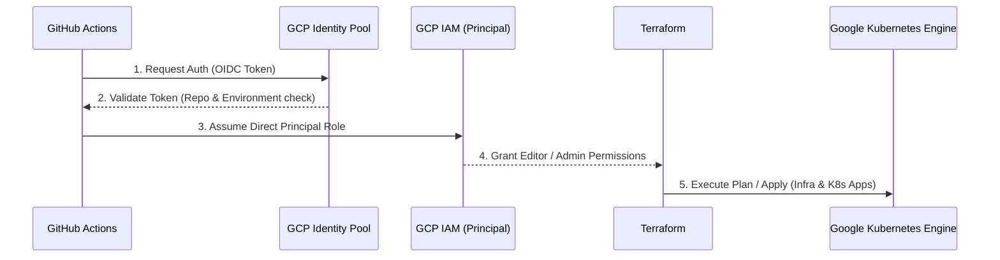

# 🚀 GCP GitOps & Kubernetes CI/CD Pipeline


An automated **Infrastructure as Code (IaC)** and **Application Deployment** pipeline for Google Cloud Platform (GCP). This project leverages **Terraform** for provisioning and **GitHub Actions** for orchestration, following a GitOps approach.

---

## 🏗️ Architecture Overview

The system is designed to manage the full lifecycle of a GKE-based environment within the GCP project `developer-sandbox-489120`.

*   **Networking:** Custom VPC with isolated subnets for GKE Nodes, Services, and Management (Jumpbox).
*   **Compute:** A Google Kubernetes Engine (GKE) **Standard** Cluster with private nodes.
*   **Security:** **Keyless Authentication** using Workload Identity Federation (WIF).
*   **Workloads:** Automated deployment of Kubernetes manifests via the Terraform `kubernetes` provider.

### 🔐 Authentication Flow (Workload Identity Federation)

To achieve zero-trust and eliminate the need for long-lived Service Account JSON keys, this project uses OIDC-based authentication.



---

## 📁 Repository Structure

The codebase is organized into modular components to separate infrastructure lifecycle from application delivery.

```text
.
├── .github/workflows/
│   ├── deploy-infra.yaml      # Provisions VPC, Subnets, and GKE Cluster
│   └── deploy-apps.yml        # Deploys K8s workloads via Terraform provider
├── environments/gcp-env-demo/
│   ├── infrastructure/        # Layer 1: Base Cloud Infrastructure
│   │   ├── backend-infra.tf   # Remote GCS backend configuration
│   │   ├── deploy-infra.tf    # Main orchestration logic
│   │   └── infra.auto.tfvars  # Environment-specific variables
│   └── k8s-apps/              # Layer 2: Kubernetes Workloads
│       ├── deploy-k8s.tf      # Deployment & Service manifests
│       └── k8s.auto.tfvars    # App-specific parameters
└── modules/                   # Reusable Terraform Modules
    ├── vpc/                   # Network & Firewall logic
    ├── gke/                   # GKE Cluster & Node Pool logic
    └── compute-engine/        # Bastion/Jumpbox configuration
```

---

## 🚀 CI/CD Pipelines

### 1. Infrastructure Pipeline (`deploy-infra.yaml`)
Triggered by changes in `environments/gcp-env-demo/infrastructure/**` or manually.
*   **Environment:** `production` (Required for IAM matching).
*   **Auth:** Direct Principal Auth (no impersonation).
*   **Logic:** Executes `terraform init`, `plan`, and `apply` (manual confirmation required for apply).

### 2. Application Pipeline (`deploy-apps.yml`)
Triggered by changes in `environments/gcp-env-demo/k8s-apps/**`.
*   **Logic:** Uses the output of the Infrastructure layer (via remote state) to connect to the GKE cluster and deploy resources.

---

## 🛠️ GCP Setup (One-Time)

To enable the keyless authentication used in this repo, the following resources must be configured in GCP:

### 1. Create Workload Identity Pool & Provider
```bash
# Create Identity Pool
gcloud iam workload-identity-pools create "github-identity-pool" \
  --project="developer-sandbox-489120" \
  --location="global" \
  --display-name="GitHub Actions Pool"

# Create OIDC Provider for GitHub
gcloud iam workload-identity-pools providers create-oidc "github" \
  --project="developer-sandbox-489120" \
  --location="global" \
  --workload-identity-pool="github-identity-pool" \
  --attribute-mapping="google.subject=assertion.sub,attribute.actor=assertion.actor,attribute.repository=assertion.repository" \
  --issuer-uri="https://token.actions.githubusercontent.com"
```

### 2. Grant Permissions to the GitHub Repository
The IAM binding is strictly scoped to the repository and the GitHub Environment (`production`):

```bash
gcloud projects add-iam-policy-binding "developer-sandbox-489120" \
  --role="roles/editor" \
  --member="principal://iam.googleapis.com/projects/697350290405/locations/global/workloadIdentityPools/github-identity-pool/subject/repo:YOUR_GH_USER/kubernetes-cicd:environment:production"
```

---

## 📝 Best Practices Followed

*   **Modular Design:** Infrastructure is split into reusable modules, allowing for easy expansion.
*   **State Management:** Remote state is stored in GCS buckets (`gcp-demo-gkefeb2026`) with locking support.
*   **Security:** No hardcoded secrets. Workload Identity Federation ensures that credentials are short-lived and non-exportable.
*   **Least Privilege:** IAM roles are bound directly to the repository identity, minimizing the attack surface.

---

## 🔧 Troubleshooting

| Issue | Root Cause | Solution |
| :--- | :--- | :--- |
| **403 Forbidden** | IAM Principal mismatch | Ensure the `environment: 'production'` is set in the GitHub Workflow. |
| **Backend 404** | GCS Bucket missing | Verify that the bucket `gcp-demo-gkefeb2026` exists in the project. |
| **GKE 401 Unauth** | Cluster connectivity | Check if `master_authorized_networks` allows the GitHub Runner IP (currently set to 0.0.0.0/0). |

---
*Developed as a GitOps reference for GCP & Kubernetes.*
