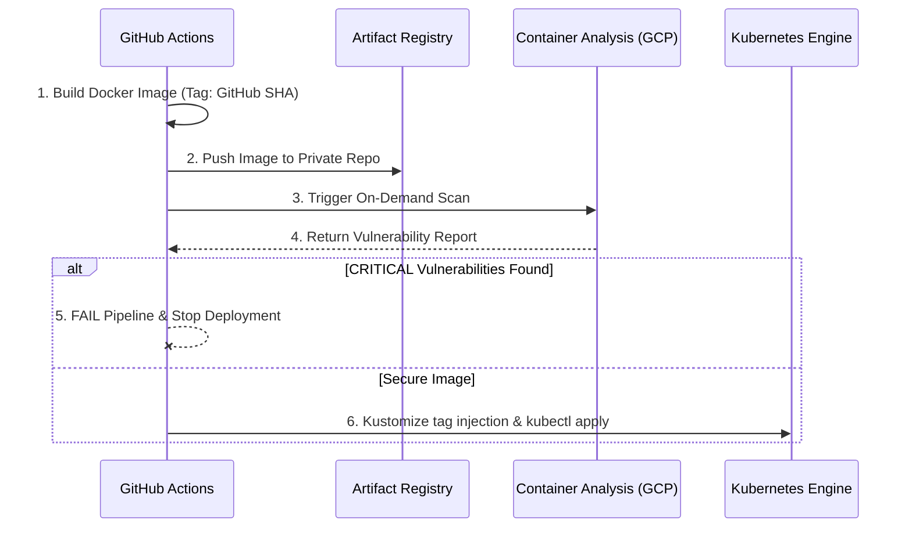

# 🚀 GCP Cloud Infrastructure & DevSecOps GKE Pipeline


A comprehensive automated solution for **GCP Infrastructure provisioning** and **Cloud-Native GKE Workload delivery**. This project serves as a **production-ready blueprint** for organizations looking to modernize multi-service workloads using a secure, end-to-end DevSecOps pipeline on Google Cloud Platform.

---

## 🏗️ Architecture Overview

The system is designed to manage the full lifecycle of a modernized microservices environment within the GCP project `developer-sandbox-489120`. It leverages a layered approach where foundational resources and application delivery are decoupled for maximum agility and security.

### 1. Foundational Infrastructure (Terraform)
The base layer is managed declaratively using Terraform, ensuring that the cloud environment is immutable and reproducible.
*   **Custom VPC Networking:** A dedicated Virtual Private Cloud with a single optimized subnetwork for GKE, eliminating unnecessary overhead while maintaining strict isolation.
*   **GKE Standard Cluster:** A robust Google Kubernetes Engine cluster configured with private nodes and master authorized networks to ensure the control plane is not exposed to the public internet.
*   **Artifact Registry:** A centralized Docker repository that serves as the single source of truth for all validated container images.
*   **Identity Management:** Uses Workload Identity Federation (WIF) to enable keyless, OIDC-based authentication between GitHub Actions and Google Cloud.

### 2. Cloud-Native Application Delivery (YAML & Kustomize)
Departing from legacy Terraform-managed Kubernetes resources, this project uses a native approach for workload orchestration.
*   **Native YAML Manifests:** Standard Kubernetes Resource definitions (Deployments, Services, Namespaces) that are familiar to developers and portable across environments.
*   **Kustomize Orchestration:** Uses Kustomize to manage environment-specific configurations and perform dynamic image injection without modifying the base source code.
*   **DevSecOps Pipeline:** A modular CI/CD system that builds images from source, performs automated security scans, and deploys validated artifacts.

---

## 🧩 The Workload: Bookinfo Suite

We utilize the **Bookinfo** application to demonstrate a realistic **Polyglot Microservices Architecture**. This choice highlights the system's ability to handle diverse runtimes and complex communication patterns.

*   **Productpage:** The frontend microservice written in **Python**. It calls the details and reviews services to populate the page.
*   **Details:** A backend service written in **Ruby**, providing book information.
*   **Reviews:** A **Java** service that provides book reviews and ratings. It has three versions (v1, v2, v3) to demonstrate traffic distribution and versioning.
*   **Ratings:** A **Node.js** service that provides ranking information for book reviews.

---

## 🌟 Modernization Strategy: Separation of Concerns

This repository showcases the strategic advantage of separating **Infrastructure provisioning** from **Application delivery**.

### Why separate them?
1.  **Developer Velocity:** Application teams can update their services and Kubernetes manifests independently without waiting for infrastructure pipelines to run or risking the corruption of the Terraform state.
2.  **Infrastructure Stability:** Foundations like networking and the GKE cluster change infrequently but carry high risk. By isolating them in their own lifecycle, we ensure that an app-level error cannot accidentally destroy a database or a network route.
3.  **Idiomatic Tooling:** Developers use standard tools like `kubectl` and `kustomize`, while SREs use `terraform`. Each team uses the best tool for their specific job.

---

## 🔐 Security & DevSecOps Flow

Security is not an afterthought; it is baked into the pipeline. We implement a "Shift-Left" security model using **GCP Container Analysis**.



### Automated Protection
The pipeline is configured to **automatically break (Exit 1)** if the Google Cloud scanner detects any vulnerability with an effective severity of `CRITICAL`. This prevents insecure code from ever reaching the production clúster.

---

## ⚠️ Important: Handling Manual Changes (Drift)

One of the most critical aspects of this architecture is how it handles the "Observed State" (what is running in GKE) versus the "Desired State" (what is written in Git).

### 1. The Single Source of Truth
**Git is the only authority.** This project follows the philosophy that no manual changes should be made directly in the Google Cloud Console or via `kubectl edit` in the clúster.

### 2. What happens if I make a manual change?
*   **No State Lock for Apps:** Unlike Terraform, which would throw a state error if it detected a drift, Kubernetes is highly flexible. If you manually change a replica count or a memory limit in the GCP Console, the clúster will accept it immediately.
*   **Non-Instant Reconciliation:** Since we are using GitHub Actions (push-based CI/CD) and not an in-clúster agent like ArgoCD, the system **will not** automatically revert your manual change the second you make it.
*   **Self-Correction on Next Run:** The next time any developer pushes code or any SRE triggers a pipeline, the `kubectl apply -k .` command will compare the clúster's state against Git. **At that moment, Git will overwrite your manual changes**, reverting the clúster to the documented desired state.

### 3. Recommendation
To maintain consistency and avoid "ghost bugs," always perform configuration changes by modifying the YAML manifests in the `environments/gcp-env-demo/k8s-manifests/` folder and pushing them to the `main` branch.

---

## 📁 Repository Structure

The codebase is strictly organized to reflect the separation between infrastructure and applications.

```text
.
├── .github/workflows/
│   ├── deploy-infra.yaml           # Provisions VPC, GKE, and Artifact Registry via Terraform.
│   ├── shared-k8s-app-pipeline.yml # MASTER TEMPLATE: Reusable logic for building and scanning.
│   ├── deploy-productpage.yml      # Caller pipeline for the Productpage microservice.
│   ├── deploy-details.yml          # Caller pipeline for the Details microservice.
│   ├── deploy-reviews.yml          # Caller pipeline for the Reviews microservice.
│   └── deploy-ratings.yml          # Caller pipeline for the Ratings microservice.
├── environments/gcp-env-demo/
│   ├── infrastructure/             # Layer 1: Terraform Base Infrastructure.
│   │   ├── deploy-infra.tf         # Main orchestration (VPC, GKE, APIs, IAM).
│   │   ├── variables-infra.tf      # Infrastructure variable declarations.
│   │   ├── providers-infra.tf      # Google Cloud provider configuration.
│   │   ├── gen-infra-outputs.tf    # Outputs used by the app pipelines (Cluster name, Registry URL).
│   │   └── infra.auto.tfvars       # Environment-specific values.
│   └── k8s-manifests/              # Layer 2: Native Kubernetes State.
│       ├── kustomization.yaml      # Kustomize entrypoint for image tag injection.
│       ├── 00-namespace.yaml       # Dedicated namespace for the application.
│       ├── 01-productpage.yaml     # Deployment and Service for the frontend.
│       ├── 02-details.yaml         # Deployment and Service for the details backend.
│       ├── 03-reviews.yaml         # Deployment and Services for the three reviews versions.
│       └── 04-ratings.yaml         # Deployment and Service for the ratings backend.
├── modules/                        # Reusable Terraform Modules.
│   ├── vpc/                        # Network and Firewall logic.
│   ├── gke/                        # GKE Cluster and Node Pool logic.
│   └── artifact-registry/          # Docker repository provisioning with cleanup policies.
├── src/bookinfo/                   # Application Source Code.
│   ├── productpage/                # Python code + Official Dockerfile.
│   ├── details/                    # Ruby code + Official Dockerfile.
│   ├── reviews/                    # Java code + Official Dockerfile.
│   └── ratings/                    # Node.js code + Official Dockerfile.
├── scripts/
│   └── fetch_bookinfo.sh           # Utility script to import official source code from Istio.
└── README.md                       # This comprehensive documentation.
```

---

## 🚀 CI/CD Pipelines Explained

### 1. Modular "Caller" Pipelines
Each microservice has its own dedicated pipeline file. These pipelines use **Path Filtering** to ensure they only run when their specific code or manifests change. This prevents unnecessary builds and reduces costs.

### 2. Shared Master Template (`shared-k8s-app-pipeline.yml`)
To keep the code DRY (Don't Repeat Yourself), all application pipelines call this shared template.
*   **Dynamic Discovery:** The template does not have hardcoded values. It **reads the Terraform State** using `terraform output` to find the current GKE clúster name and Artifact Registry URL.
*   **Build & Scan:** It builds the Docker image natively, pushes it to GCP, and performs the vulnerability scan.
*   **Immutable Deployment:** It uses `kustomize edit set image` to replace the `latest` placeholder with the unique `github.sha` tag before deploying.

---

## 🛠️ GCP Setup & Integration

### 1. Keyless Authentication (Workload Identity)
The pipeline uses OIDC to securely authenticate without JSON keys. The GCP principal must be bound to the repository and the specific environment:
`principal://iam.googleapis.com/projects/PROJECT_NUMBER/locations/global/workloadIdentityPools/github-identity-pool/subject/repo:USER/REPO:environment:production`

### 2. Required APIs
The infrastructure layer automatically ensures the following APIs are active:
*   `containeranalysis.googleapis.com` (Vulnerability database)
*   `ondemandscanning.googleapis.com` (Real-time image scanning)

---

## 🛤️ Deployment Workflow (Step-by-Step)

1.  **Code Commit:** A developer pushes a change to `src/bookinfo/ratings/ratings.js`.
2.  **Detection:** GitHub Actions triggers **only** the `Deploy: Ratings` workflow.
3.  **Infrastructure Sync:** The pipeline initializes Terraform to read the current clúster and registry info.
4.  **DevSecOps Cycle:**
    *   Image is built with the commit SHA tag.
    *   Image is pushed to Artifact Registry.
    *   GCP performs a security scan.
5.  **Kustomize Mutation:** The local `kustomization.yaml` is updated with the new image URL and SHA tag.
6.  **GKE Apply:** `kubectl apply -k` is executed, and Kubernetes performs a rolling update of the Ratings service.

---

## 🧨 Environment Cleanup (Nuke Option)

The repository includes a safety-first destruction pipeline (`nuke-destroy-envs.yaml`):
1.  **Plan First:** It always executes a `terraform plan -destroy` so you can review what will be deleted.
2.  **Full Destruction:** Upon manual confirmation, it runs `terraform destroy` on the infrastructure layer.
3.  **Implicit Cleanup:** By destroying the VPC and the GKE cluster, all Kubernetes workloads are automatically removed from Google Cloud.

---
*Developed as a modernized Cloud-Native reference for GCP, Kubernetes, and DevSecOps.*
