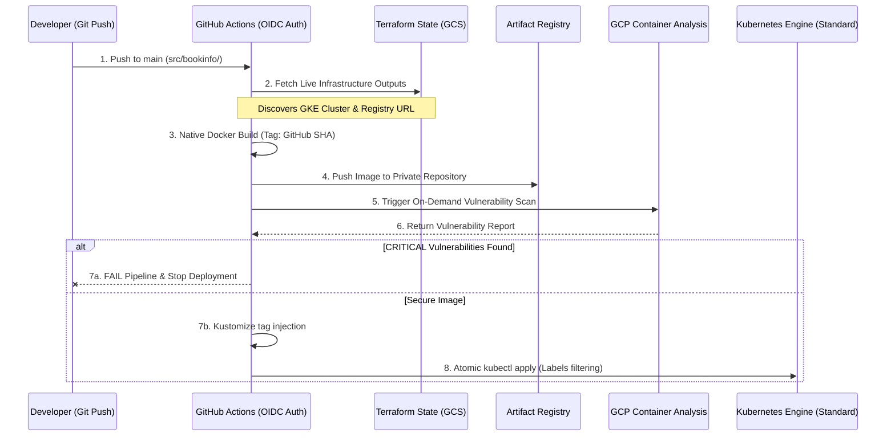

# 🚀 GCP Cloud Infrastructure & DevSecOps Master Blueprint


## 📖 1. Executive Summary & Core Philosophy

This repository is a high-end technical framework designed to demonstrate **Enterprise-Grade Modernization on Google Cloud Platform (GCP)**. It moves beyond simple script collections by implementing a **production-ready, zero-trust architecture** for polyglot microservices.

### The Strategic Modernization Goal
The core objective is to showcase the **Separation of Concerns**. We decouple the lifecycle of foundational cloud resources (Infra) from the rapid delivery cycle of applications (K8s). This ensures that infrastructure remains stable and secure, while application teams gain the autonomy to deploy multiple times a day using native Kubernetes tooling.

### Architectural Pillars
*   **Immutability:** Images and infrastructure are versioned and never modified in place.
*   **Infrastructure Discovery:** Pipelines dynamically discover their target environment by reading Terraform state, eliminating hardcoded variables.
*   **Automated Security Gates:** Integrated GCP Container Analysis API prevents the deployment of any container with `CRITICAL` vulnerabilities.

---

## 🔐 2. The DevSecOps Lifecycle (Architecture Flow)

Our system implements a strict, automated security model. The following diagram visualizes how a code change travels from a developer's machine to the production clúster, passing through multiple security and validation gates.



---

## 📁 3. Exhaustive Repository Directory Map

Below is the complete structure of the repository, detailing the purpose of every key file and its role in the overall architecture.

```text
.
├── .github/workflows/
│   ├── deploy-infra.yaml           # MASTER INFRA PIPELINE: Manages the VPC, GKE, and Artifact Registry. Requires manual "Apply" approval.
│   ├── shared-k8s-app-pipeline.yml # MASTER APP TEMPLATE: A Reusable Workflow containing the Build -> Scan -> Push -> Deploy logic.
│   ├── deploy-productpage.yml      # Microservice Caller: Triggers on Python code changes and calls the Master Template.
│   ├── deploy-details.yml          # Microservice Caller: Triggers on Ruby code changes and calls the Master Template.
│   ├── deploy-reviews.yml          # Microservice Caller: Triggers on Java code changes and calls the Master Template.
│   ├── deploy-ratings.yml          # Microservice Caller: Triggers on Node.js code changes and calls the Master Template.
│   └── nuke-destroy-envs.yaml      # EMERGENCY PIPELINE: Structured destruction of the entire GCP environment and state cleanup.
├── environments/gcp-env-demo/
│   ├── infrastructure/             # LAYER 1: Foundational Cloud Infrastructure (Terraform).
│   │   ├── deploy-infra.tf         # Orchestration file: Calls modules, enables GCP APIs, and configures WIF IAM permissions.
│   │   ├── variables-infra.tf      # Global variable declarations for the infrastructure project.
│   │   ├── providers-infra.tf      # Configures the Google provider version and required backend.
│   │   ├── gen-infra-outputs.tf    # THE BRIDGE: Defines the outputs (Cluster Name, GAR URL) read by the app pipelines.
│   │   └── infra.auto.tfvars       # Environment Values: Defines the actual names (gke-demo-standard) and regions.
│   └── k8s-manifests/              # LAYER 2: Application Desired State (Native Kubernetes).
│       ├── kustomization.yaml      # ENTRY POINT: Manages all manifests and defines placeholders for dynamic image tags.
│       ├── 00-namespace.yaml       # Defines the 'bookinfo' logical isolation boundary.
│       ├── 01-productpage.yaml     # Service & Deployment for the frontend.
│       ├── 02-details.yaml         # Service & Deployment for the details backend.
│       ├── 03-reviews.yaml         # Service & Deployment for the Java backend (v1, v2, v3).
│       └── 04-ratings.yaml         # Service & Deployment for the ratings backend.
├── modules/                        # REUSABLE BLUEPRINTS (Terraform Modules).
│   ├── vpc/                        # Clean networking module: Provisions the VPC and the optimized GKE subnetwork.
│   ├── gke/                        # Cluster module: Provisions the Standard GKE cluster with Drift Protection rules.
│   └── artifact-registry/          # Storage module: Provisions the Docker Repo with auto-cleanup policies (keep 10).
├── src/bookinfo/                   # APPLICATION SOURCE CODE (Polyglot microservices).
│   ├── productpage/                # Python frontend + Official Dockerfile.
│   ├── details/                    # Ruby service + Official Dockerfile.
│   ├── reviews/                    # Java service + Official Dockerfile.
│   └── ratings/                    # Node.js service + Official Dockerfile.
├── scripts/
│   └── fetch_bookinfo.sh           # UTILITY: Script to import official Istio source code into this repo structure.
└── README.md                       # This master documentation.
```

---

## 🏛️ 4. Detailed Component Relationships

### A. The Terraform-to-Pipeline Bridge
This is the most advanced part of our architecture. Instead of hardcoding the name of the GKE cluster or the Artifact Registry URL in the YAML pipelines, the **Shared Pipeline** runs `terraform output` at the start of every job. 
*   **Why?** This ensures that if an SRE renames the clúster in Terraform, the application pipelines will "discover" the new name automatically in their next run, preventing broken deployments.

### B. Kustomize as the Mutation Engine
The Kubernetes manifests in `k8s-manifests/` use placeholders like `productpage-image`. 
1.  The pipeline builds a real image with a unique tag (the **GitHub Commit SHA**).
2.  The pipeline runs `kustomize edit set image`.
3.  Kustomize generates a temporary, final YAML where the placeholder is replaced by the real, versioned image.
4.  This final YAML is sent to GKE, ensuring **100% traceability** between a commit and a running container.

### C. Zero-Trust via Workload Identity Federation (WIF)
We do not store Google Cloud JSON keys in GitHub Secrets. 
1.  GitHub Actions requests a short-lived token from Google.
2.  Google validates the **OIDC identity** (Repository name + Branch).
3.  Google grants the Runner temporary permissions to build, scan, and deploy.
4.  The token expires the moment the pipeline finishes.

---

## ⚠️ 5. Operational Governance: Managing State & Drift

### Infrastructure Drift (Terraform)
We implemented a `lifecycle { ignore_changes }` block in the GKE module. This is a "pro" move to prevent Terraform from trying to undo internal Google Cloud tags (`resource_manager_tags`) which often cause fake discrepancies in the reports.

### Application Drift (Kubernetes)
Unlike Terraform, Kubernetes manifests don't have a "lock". If you manually use `kubectl edit` to change a service, the change will work temporarily. However, **Git is the Single Source of Truth**. The very next time any developer pushes code, the pipeline will run `kubectl apply -k .`, which will **automatically overwrite your manual changes** and restore the clúster to the state defined in Git.

---

## 🚀 6. Operator Step-by-Step Guide

### Phase 1: Infrastructure Provisioning
1.  Open the **Actions** tab in GitHub.
2.  Select the **Deploy Infra (Terraform)** workflow.
3.  Click **Run workflow**, and **ensure the checkbox "Run Terraform Apply?" is marked**.
4.  This will provision the VPC, Cluster, and Registry (~10 minutes).

### Phase 2: Microservice Deployment
1.  Any push to `src/bookinfo/` or `k8s-manifests/` will trigger the respective microservice pipeline.
2.  The system will build the Docker image natively from the official source code.
3.  The GCP Scanner will validate the image.
4.  Kustomize will inject the SHA tag and deploy to the `bookinfo` namespace.

### Phase 3: Verification
1.  Run `kubectl get svc -n bookinfo`.
2.  Locate the External IP of the `productpage` service.
3.  Visit `http://<EXTERNAL_IP>:9080/productpage` to see the live application.

---
*Developed as a world-class engineering reference for GCP, Kubernetes, and DevSecOps.*
